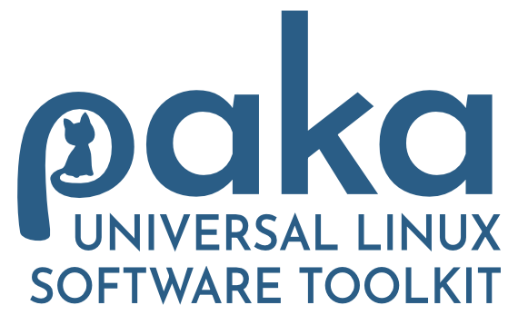

<!-- Centered Logo and Tagline -->
<p align="center">
  
</p>

<p align="center">
  <b>An extensible package management toolkit:</b><br>
  <em>
     Install, update, remove, and manage packages across most major distributions. Includes AppImage support, package and package-manager health checks, history tracking with rollback features, Docker, Snapper snapshot integration, and more.
  </em>
</p>

<p align="center">
  <a href="https://www.gnu.org/licenses/gpl-3.0.html">
    
  </a>
</p>

<hr/>

<!-- Features Section -->
<h2 align="center">Features</h2>

<table align="center">
  <tr><td><b>Unified Interface</b></td><td>Single command syntax for all major package managers</td></tr>
  <tr><td><b>Search</b></td><td>Filtering, categorization, and fuzzy matching</td></tr>
  <tr><td><b>Plugin System</b></td><td>Template-based and Python-based plugins for custom features</td></tr>
  <tr><td><b>Session Tracking</b></td><td>Remembers user preferences and tracks command history</td></tr>
  <tr><td><b>Installation History</b></td><td>Track installations with dependency information and rollback capabilities</td></tr>
  <tr><td><b>Health Checks</b></td><td>Multi-manager health checks with risk assessment and interactive fixes</td></tr>
  <tr><td><b>Shell Integration</b></td><td>Command-not-found suggestions</td></tr>
  <tr><td><b>Colorful Interface</b></td><td>Colorful, easy-to-read tables and progress indicators</td></tr>
  <tr><td><b>XDG Compliance</b></td><td>Full XDG Base Directory specification support</td></tr>
</table>

<hr/>

<!-- Install Section -->
<h2 align="center">🚀 Quick Start</h2>

<p align="center"><b>Installation:</b></p>

```bash
git clone https://github.com/luvis/paka.git
cd paka
./install.sh
```

<p align="center"><b>Basic Usage:</b></p>

```bash
paka search <package>          # Search across all package managers
paka install <package>         # Install a package
paka remove <package>          # Remove a package
paka update                    # Update package lists
paka upgrade                   # Upgrade installed packages
paka health                    # Run health checks
paka config                    # Interactive configuration
```

<hr/>

<!-- Supported Managers Section -->
<h2 align="center">📦 Supported Package Managers</h2>

<p align="center">
  DNF • APT • Pacman • Flatpak • Snap • Zypper • Portage • Yay • Slackpkg • APK • XBPS • APX • Nix • Slpkg
</p>
<p align="center">
  <i>+ Docker & AppImage via plugins</i>
</p>

<hr/>

<!-- Development Status -->
<h2 align="center">🛠️ Development Status</h2>
<p align="center">
⚠️ <b>Note:</b> PAKA is currently in active development. While the core functionality is implemented, some features may still be in progress.
</p>

<!-- Divider before technical docs -->
<hr/>

<!-- BEGIN TECHNICAL DOCUMENTATION (from original README) -->

# Technical Documentation

## Features

- **Unified Interface**: Single command syntax for multiple package managers
- **Search**: Filtering, categorization, and fuzzy matching
- **Plugin System**: Template-based and Python-based plugins for custom features
- **Session Management**: Remembers user preferences and tracks command history
- **Installation History**: Track installations with dependency information and rollback capabilities
- **Health System**: Multi-manager health checks with risk assessment and interactive fixes
- **Shell Integration**: Optional command-not-found suggestions
- **Colorful Interface**: Colorful, easy-to-read tables and progress indicators
- **XDG Compliance**: Full XDG Base Directory specification support
- **Privilege Management**: Context-aware privilege escalation
- **Scope Support**: User and system-wide configuration and plugin management

## Supported Package Managers

### Currently Implemented ✅
- **DNF** (Fedora, RHEL, CentOS)
- **APT** (Debian, Ubuntu)
- **Pacman** (Arch Linux)
- **Flatpak** (Universal)
- **Snap** (Universal)
- **Zypper** (openSUSE)
- **Portage/Emerge** (Gentoo)
- **Yay** (AUR helper)
- **Slackpkg** (Slackware)
- **APK** (Alpine)
- **XBPS** (Void Linux)
- **APX** (Vanilla OS)
- **Nix** (NixOS, Universal)
- **Slpkg** (Slackware)

### Plugin-Based Managers
- **Docker** (via plugin)
- **AppImage** (via advanced plugin system)

## Architecture

PAKA is built with extensibility and user experience in mind:
- **Core Engine**: Command orchestration and session management
- **Package Manager Registry**: Manages all package manager implementations
- **Session Manager**: Tracks user behavior and preferences
- **History Manager**: Installation tracking with dependency information and rollback capabilities
- **Health Manager**: Multi-manager health monitoring and fixes
- **UI Manager**: Colorful output with progress indicators
- **Plugin Manager**: Extensible plugin system with simple templates
- **Config Manager**: Hierarchical configuration management
- **Directory Manager**: XDG and system-wide directory standards
- **Privilege Manager**: Context-aware privilege escalation
- **Shell Integration**: Command-not-found suggestions
- **Menu System**: Interactive configuration and management
- **Wizard System**: Guided setup and configuration

## Plugin System

PAKA includes a plugin system with three types:

### 1. Runtime Plugins
Actions that happen during PAKA operations:
- Notifications
- Logging
- Backups
- Custom scripts

### 2. Health Check Plugins
Custom health checks and fixes:
- Disk usage monitoring
- Temp file cleanup
- Permission fixes
- Custom maintenance tasks

### 3. Package Manager Plugins
Support for custom package managers:
- Docker containers
- Custom package formats
- Specialized installers

### Creating Plugins
```bash
# Create a new plugin template
paka config plugins create

# Choose plugin type:
# - Runtime (actions during operations)
# - Health Check (custom health checks)
# - Package Manager (custom package managers)
```

## Health System

PAKA includes health monitoring for package management:

- **Multi-Manager Health Checks**: All 14 supported package managers
- **Interactive Fix System**: Numbered menu for selecting fixes
- **Safe Operations**: All fixes are safe and package manager-specific
- **Real-time Monitoring**: Check system health before critical operations
- **Auto-Fix Mode**: `--fix-all` flag for automated resolution

Health check categories:
- **Package Manager Locks**: Detect and remove lock files from all package managers
- **Failed Installations**: Clean up partial installations and incomplete transactions
- **Broken Packages**: Package manager-specific broken package detection and fixes
- **Corrupted Databases**: Database corruption detection and repair
- **Cache Management**: Package manager cache cleanup and bloat detection
- **Third-party Repository Health**: Repository error detection and fixes
- **Orphaned Package Cleanup**: Remove unused dependencies

### Package Manager Lock Detection
Detects lock files from:
- DNF, APT, Pacman, Zypper, Portage, XBPS, APK, Flatpak, Snap
- Prevents conflicts when package managers are running
- Safe removal with appropriate warnings

### Failed Installation Recovery
Handles incomplete transactions from:
- DNF transaction files
- APT partial downloads
- Pacman lock states
- Other package manager partial states

### Package Manager-Specific Health
Each manager has specialized health checks:
- **DNF**: Broken packages, corrupted RPM database
- **APT**: Broken packages, dependency issues
- **Pacman**: Package integrity, database health
- **Flatpak**: Installation repair, remote health
- **Snap**: Installation verification
- **Zypper**: Repository health, package conflicts
- **Emerge**: Portage system integrity
- **Yay**: AUR helper functionality
- **Slackpkg**: Slackware package health
- **APK**: Alpine package verification
- **XBPS**: Void package integrity
- **APX**: Vanilla OS package health
- **Nix**: Nix store verification
- **Slpkg**: Slackware package management

## Configuration

PAKA supports both user and system-wide configuration:

- **User Scope**: `~/.config/paka/` (default)
- **System Scope**: `/etc/paka/` (requires root)
- **Interactive Configuration**: `paka config` opens menu-based wizard
- **Plugin Management**: Enable/disable plugins, create templates
- **Package Manager Preferences**: Configure which managers to use
- **Health Settings**: Customize health check behavior

## Shell Integration

Optional command-not-found suggestions:
- **Multi-Shell Support**: bash, zsh, fish
- **Smart Suggestions**: Suggest package installation when commands aren't found
- **Opt-in**: Can be enabled/disabled in configuration
- **Installation**: `paka config` → Shell Integration

## History Management

Installation tracking and rollback capabilities:
- **Installation Records**: Track all installations with dependencies
- **Rollback Capabilities**: Uninstall packages and dependencies from specific installations
- **Status Reconciliation**: Sync history with actual package status
- **Search**: Search installation history
- **Statistics**: Usage statistics and trends

### Rollback Usage
```bash
paka history list                    # List recent installations
paka history show <installation_id>  # Show installation details
paka history rollback <installation_id>  # Remove packages from installation
paka history rollback <installation_id> --purge  # Purge packages and configs
```

## Installation

### System-wide Installation
```bash
./install.sh
```

The installer includes:
- Package manager detection
- Interactive configuration wizard
- Shell integration setup
- Plugin template creation

### Uninstallation
```bash
paka config  # → Uninstall PAKA
```

Granular uninstall options:
- Remove PAKA only (keep user data)
- Remove PAKA and user data
- Remove PAKA and ALL data (complete cleanup)
- Granular removal (choose components)

## Licensing

PAKA is dual-licensed to accommodate both open-source and commercial use:

### Open Source License (GPLv3)
You may use, modify, and redistribute PAKA under the terms of the GNU General Public License v3 (GPLv3). This means:
- You can freely use PAKA for personal and open-source projects
- You can modify the source code and distribute your modifications
- Any derivative works must also be licensed under the GPLv3
- See the [LICENSE](LICENSE) file for the full GPLv3 text

### Commercial License
If you wish to use PAKA in proprietary, closed-source, or commercial products, a separate commercial license is required. This includes:
- Using PAKA in proprietary software
- Distributing PAKA as part of a commercial product
- Using PAKA in enterprise environments with proprietary modifications
- Any use that would otherwise violate the GPLv3 terms

**For commercial licensing inquiries, please contact:** hello@hoozter.com

## Repository

https://github.com/luvis/paka

## Contact

- **Commercial Licensing**: hello@hoozter.com
- **Support & General Inquiries**: hello@hoozter.com
- **Bug Reports**: Please use GitHub Issues
- **Feature Requests**: Please use GitHub Issues

## License

See [LICENSE](LICENSE) for the full GNU GPLv3 text. 